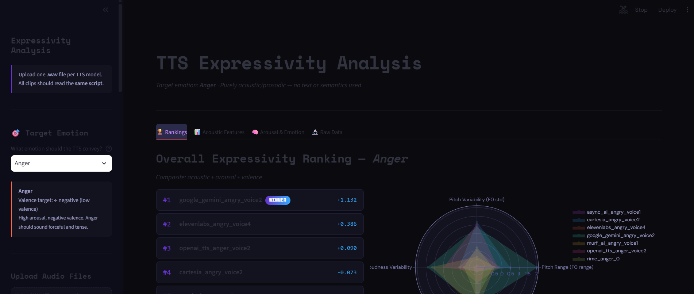
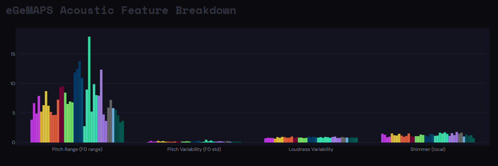
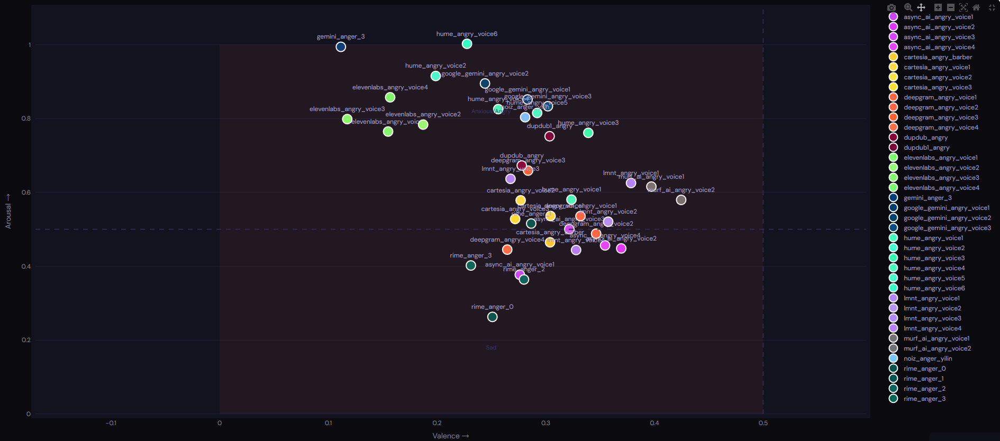
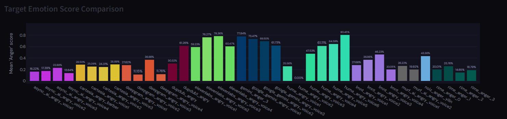

# Text-to-Speech Evaluation Programs

This project contains two programs for generating and evaluating synthetic voice output across multiple text-to-speech (TTS) providers:

- **`batch_generation.py`** — generates audio samples in bulk
- **`tts_expressivity_dashboard`** — analyzes and compares the generated samples

## Overview

This project was developed to test which TTS providers produce synthetic voices that are the most realistic, consistent, and capable of expressing diverse emotions.

### Batch Generation

A helper script that makes API calls to available TTS providers, generating a high volume of audio outputs for the same text — each with customized instructions — all at once. Currently supports **16 TTS providers**, all leaders in the synthetic voice industry.

### Expressivity Dashboard

Provides the actual analysis of generated voice samples. At the time of this project's completion, three metrics were used:

1. **Acoustic features** — simple measures such as pitch variability, volume variability, and HNR
2. **Arousal-Valence model** — a widely used framework for emotional expression
3. **Hume AI's Expression Measurement API**

> **Note:** In June 2026, Hume discontinued their Expression Measurement features, so the program was refactored to use only acoustic features and arousal-valence. One of the screenshots below shows what part of the Hume analysis component looked like prior to this change.

## Models & Providers

- **Acoustic features** — [audEERING's eGeMAPSv02](https://audeering.github.io/opensmile/) via openSMILE
- **Arousal-Valence** — wav2vec

## Live Demo
 
Both programs are hosted on Streamlit:
 
- **Batch Generation:** [link](https://sail-tts-batch-generation.streamlit.app/)
- **Expressivity Dashboard:** [link](https://sail-tts-eval.streamlit.app/)

## Setup

1. Install dependencies:
   ```bash
   pip install -r requirements.txt
   ```
2. Copy `.env.example` to `.env` and fill in your API keys for the providers you want to use.

## Usage

<!-- Add a quick example, e.g.: -->
```bash
streamlit run tts_expressivity_dashboard.py
streamlit run batch_generation.py
```

## Screenshots






## Acknowledgments

AI tools were used to assist in the programming of this project.

